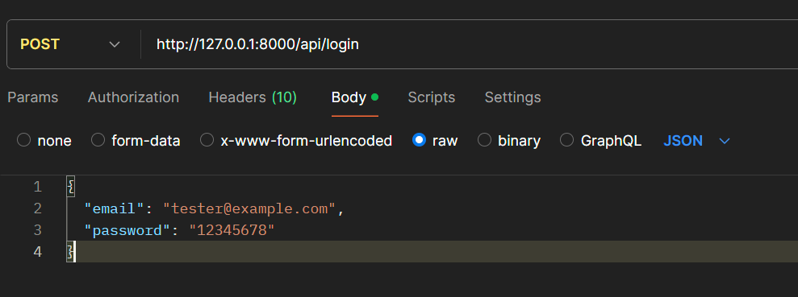
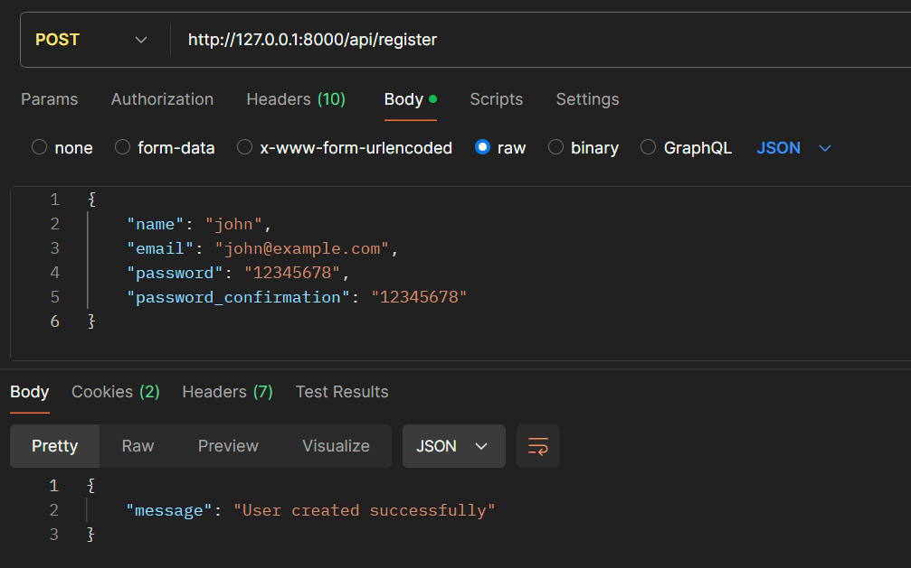

<p align="center">
    <a href="https://laravel.com/"></a>
    <a href="https://www.php.net/"></a>
    <a href="https://github.com/orphail/laravel-ddd/actions"></a>
</p>


**✅ The list below shows personal ideas, and concepts to use clean, decoupled code aligned with SOLID principles.**  
***Details 👉🏻 [HERE](README/README.md):***
1. **Response Strategy.**
2. **Policy Example.**
3. **Handling the Roles/Permissions with spatie/laravel-permission and personalized middleware for the access to the resources.**
4. **Dispatching events for a specific function from a decorated repository.**
5. **Swagger OpenAPI to align work between the backend and frontend.**
6. **API Versioning.**
7. **Handling Cache.**


## Project specification

This sample project is managing gateways - master devices that control multiple peripheral devices. 

The task is to create a REST service (JSON/HTTP) for storing information about these gateways and their associated devices. This information must be stored in the database. 

- When storing a gateway, any field marked as “to be validated” must be validated and an error returned if it is invalid.
- Also, no more that 10 peripheral devices are allowed for a gateway.
- The service must also offer an operation for displaying information about all stored gateways (and their devices) 
- Operation for displaying details for a single gateway. 
- It must be possible to add and remove a device from a gateway.
- Basic UI - recommended or (providing test data for Postman (or other rest client) if you do not have enough time.
-  Meaningful Unit tests.
-  Readme file with installation guides.
-  An automated build.

## Entities

**gateway**:

- a unique serial number (string), 
- human-readable name (string),
- IPv4 address (to be validated),
- multiple associated peripheral devices. 

**peripheral**:
- a UID (number),
- vendor (string),
- date created,
- status - online/offline.

Laravel is accessible, powerful, and provides tools required for large, robust applications.

## Prerequisites

Before you begin, make sure you have the following installed:

- **PHP** >= 8.0
- **Composer** - [Installation Instructions](https://getcomposer.org/download/)
- **MySQL** 

## Installation

Follow these steps to set up the project on your local environment:

1. **Clone the repository**

   Clone this repository to your local machine using Git:
   ```bash
   git clone https://github.com/magerosco/gateways.git
2. **Navigate to the project directory**

    Use Composer to install all required PHP dependencies:
    ```bash
    cd your-project
3. **Install PHP dependencies**
    ```bash
    composer install
4. **Set up the .env file**

    Copy the .env.example file to .env:
    ```bash
    cp .env.example .env
 - Open the .env file in your preferred text editor and configure the database connection and other environment settings.
 
 5. **Generate the application key**
 
    Laravel requires an application key to encrypt data. Generate this key using the following command:
    ```bash
    php artisan key:generate
6. **Set up the database**

    Ensure your database is created and correctly configured in the .env file. Then run the migrations to create the tables:
    
    ```bash
    php artisan migrate
7. **Seed the database**
    Includes seeders, you can populate the database with initial data using:
    ```bash
    php artisan db:seed
8. **Start the development server**
    ```bash
    php artisan serve
- By default, the application will be available at http://localhost:8000.

## Testing 

 **(Recommended) You can run the feature's tests using PHPUnit:**

```bash
    php artisan test --filter=PeripheralTest
```

```bash
    php artisan test --filter=GatewayTest
```

 **(Optional) You can run the project's tests using PHPUnit:**

```bash
    php artisan test
```
 
 ## Testing REST service with postman 

```
  GET|HEAD        api/gateway   
  POST            api/gateway   
  GET|HEAD        api/gateway/{gateway}   
  PUT|PATCH       api/gateway/{gateway}   
  DELETE          api/gateway/{gateway}   
   

  GET|HEAD        api/peripheral 
  POST            api/peripheral   
  GET|HEAD        api/peripheral/{peripheral}   
  PUT|PATCH       api/peripheral/{peripheral} 
  DELETE          api/peripheral/{peripheral} 
```
**Note: You must use the admin credentials to delete path: *api/peripheral/{peripheral}* or *api/gateway/{gateway}.***
1. **Login to get the token.**

```
POST            api/login

Body raw:
{
  "email": "admin@admin.com",
  "password": "admin"
}
```


2. **(Optional), you can create a new user and then login.**
```
POST            api/register

Body raw:
{
    "name": "john",
    "email": "john@example.com",
    "password": "12345678",
    "password_confirmation": "12345678"
}
```

