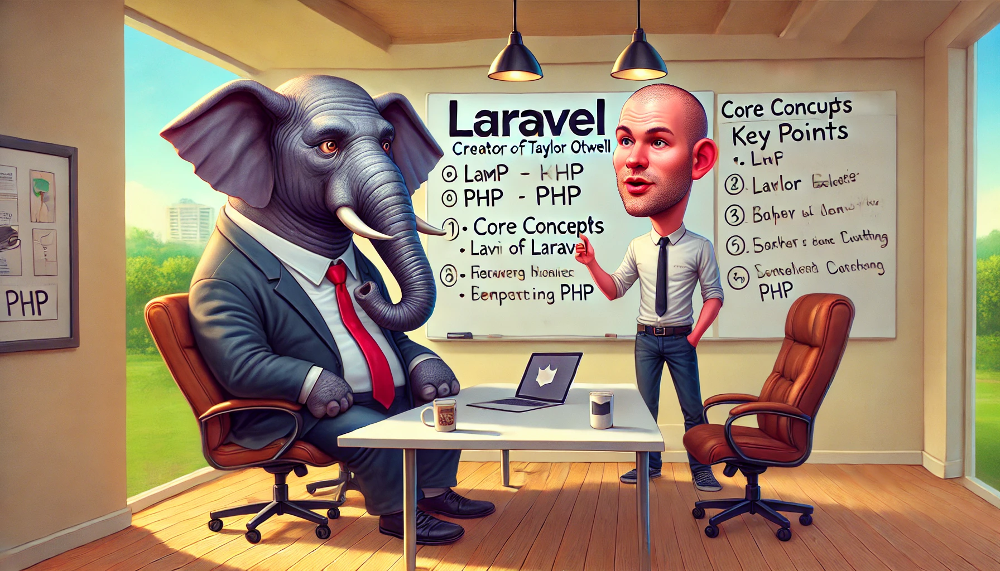

<p align="center">
    <a href="https://laravel.com/"></a>
    <a href="https://www.php.net/"></a>
    <a href="https://github.com/magerosco/gateways/actions/workflows/ci.yml"></a>
</p>

<div align="center">

</div>


## This project is a compilation of exercises covering different aspects of Laravel. What you will find here is:


**✅ The list below shows personal ideas, and concepts to use clean, decoupled code aligned with SOLID principles.**  
***Details 👉🏻 [HERE](README/README.md):***
1. **Coexistence of Oauth+JWT and Sanctum for versioned APIs.**
2. **Policy Example.**
3. **Handling the Roles/Permissions with spatie/laravel-permission and personalized middleware for the access to the resources.**
4. **Dispatching events for a specific function from a decorated repository.**
5. **Swagger OpenAPI to align work between the backend and frontend.**
6. **API Versioning.**
7. **Handling Cache.**
8. **Response Strategy.**

**✅ Features:**
1. **Created a controller with the API**
2. **Define routes with prefixes**
3. **Sanitize data by middleware to ensure data integrity before validations**
4. **Handle roles by own middleware or by the spatie/laravel-permission package**
5. **Authentication with Sanctum**
6. **Authentication with OAuth+JWT and use public and private keys for OAuth authentication with Laravel Passport.**
7. **Write tests and setUp method for each feature**
8. **Implement event handling**
9. **Implemented logs for events and validated log structure in tests**
10. **Use Illuminate\Http\Response defining responses with appropriate status codes.**
11. **Use Laravel Resources to define the structure of outgoing data with custom fields.**
12. **Protect endpoints with rate limiting (throttle middleware)**
13. **Validate inputs using Form Requests to handle the responsibility of validation in a single place.**
14. **Configured CORS and used the database to dynamically manage allowed origins.**

✅ **Design Patterns.** *Click to read more:*
<details> <summary><b>1. Repository Layer Design Pattern:<b></summary>

***Note: Dependency injection by interface and handling it  from the provider as part of multiple dependency classes that need to be injected into the same class***
[CrudRepositoryInterface](app/Repositories/CrudRepositoryInterface.php)<br>
[GatewayRepository](app/Repositories/GatewayRepository.php)<br>
[InterfaceServiceProvider](app/Providers/InterfaceServiceProvider.php#L56)<br>
</details>


<details> 
<summary><b>2. Service Layer Design Pattern:<b></summary>

***Note: Basic example using inheritance between interfaces and handling  the multiple dependency classes that need to be injected into the same class.***

[GatewayService](app/Services/Gateway/GatewayService.php) <br>
[GatewayServiceInterface](app/Services/Gateway/GatewayServiceInterface.php)<br>
[GatewayServiceDestroyV2Interface](app/Services/Gateway/GatewayServiceDestroyV2Interface.php)<br>
[InterfaceServiceProvider](app/Providers/InterfaceServiceProvider.php#L38)<br>
[GatewayController](app/Http/Controllers/Api/V2/GatewayController.php#L88)
</details>

<details>
<summary><b>3. Observer Design Pattern<b></summary>

***Note: This app use cache (DB, Redis, etc..), and the example attempts to make use of the observer for clear the cache when a resource is created, updated or deleted.***
[GatewayObserver](app/Observers/GatewayObserver.php)<br>
</details>

<details>
<summary><b>4. Decorator Design Pattern<b></summary>

***Note: Dispatching events for a specific function from a decorated repository to avoid coupling the code logic.***

[GatewayRepository](app/Repositories/GatewayRepository.php#L49)<br>
[GatewayRepositoryDecorator](app/Repositories/Decorators/GatewayRepositoryDecorator.php#L18)<br>
</details>
<details>
<summary><b>5. Event-Driven Pattern<b></summary>

***Note: This example works in combination with the Decorator Design Pattern to decouple the code logic.***

[GatewayUpdated](app/Events/GatewayUpdated.php)<br>
[GatewayUpdatedListener](app/Listeners/GatewayUpdatedListener.php)<br>
</details>

<details>
<summary><b>6. Strategy Pattern.<b></summary>

***Note: This example combines middleware, a vendor package, factory and the strategy pattern as an optional solution to handle the type of output that will be implemented for a crud. With middleware as a starting point, this only works for endpoints that apply it.👉🏻 [Details:](README/README.md)***

[ApiOrWebMiddleware](app/Http/Middleware/ApiOrWebMiddleware.php)<br>
[GatewayController](app/Http/Controllers/GatewayController.php#L34)<br>
[Vendor/ResponseStrategy](vendor/anasa/response-strategy/src/)

</details>

## Installation

First steps:

```bash
    composer install
    cp .env.example .env
    php artisan key:generate
    php artisan migrate
    php artisan db:seed
    php artisan serve
``` 

## Testing 
 
 ## Check the available endpoints to test with postman 

```
  php artisan route:list
```
**Note: You must use the admin credentials to delete path: *api/peripheral/{peripheral}* or *api/gateway/{gateway}.***
1. **Login to get the token.**

```
POST            api/login

Body raw:
{
  "email": "admin@admin.com",
  "password": "admin"
}
```


## RabbitMQ

- **RabbitMQ** - [Installation Instructions](https://www.rabbitmq.com/docs/install-windows)

**Active the interface by PowerShell:**

```bash
 C:\Program Files\RabbitMQ Server\rabbitmq_server-4.0.5\sbin> .\rabbitmq-plugins.bat enable rabbitmq_management
```
**Rum server**

```bash
    C:\Program Files\RabbitMQ Server\rabbitmq_server-4.0.5\sbin> .\rabbitmq-server.bat
```
- Default URL: http://localhost:15672
- Default user: guest
- Default password: guest
