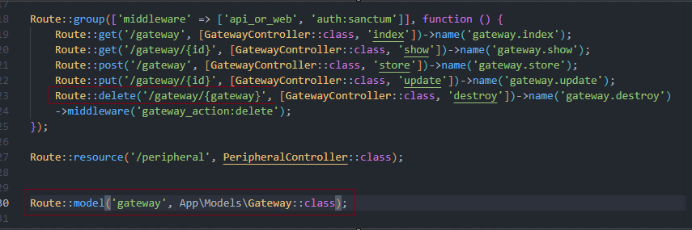
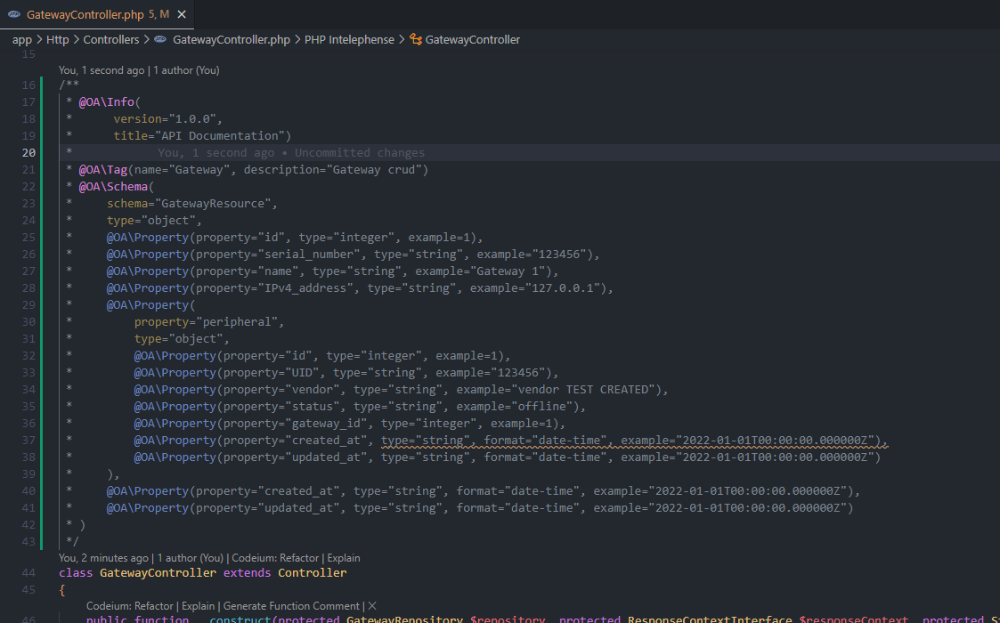
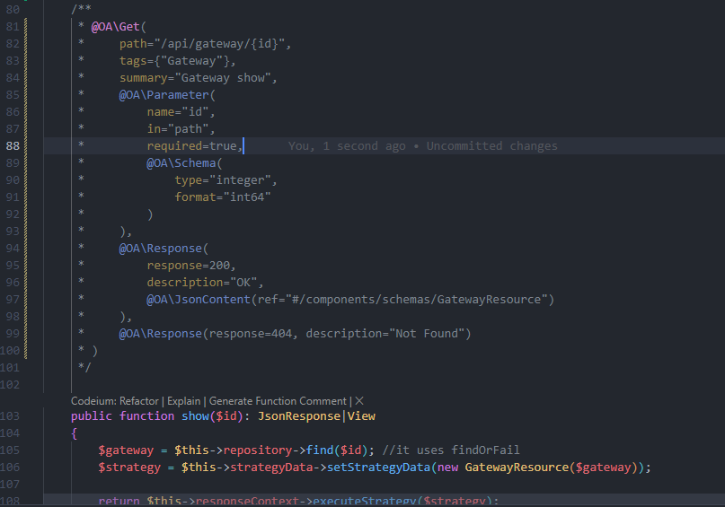

***These are simple examples of integrating the logic of any specific requirement ensuring that good programming practices are maintained, complying with SOLID principles, and applying design patterns in search of a correct code structuring.***

## Policy Example
<details>
<summary>
This is a solution that seeks to maintain the sole responsibility of the classes. Therefore, managing security and/or accessibility to the functionalities from the controllers would fail to comply desire to have decoupled code.
</summary>

```php
 public function edit(Post $post)
    {
        $this->authorize('update', $post);
        return view('posts.edit', compact('post'));
    }
```
In this case, ***$this->authorize('update', $post);***  the accessibility from the controller,  as an alternative, a solution built with a middleware and a policy, it handles the accessibility isolate from the controller.

In addition, the route is loading the resource.



Check also:
```php	
 use App\Http\Middleware\GatewayActionMiddleware;
 use App\Policies\GatewayPolicy;
```

**USE** *Illuminate\Foundation\Support\Providers\AuthServiceProvider* FROM **AppServiceProvider.php**
```php
namespace App\Providers;
/*...code */
use Illuminate\Foundation\Support\Providers\AuthServiceProvider as ServiceProvider;

class AppServiceProvider extends ServiceProvider
{
    protected $policies = [
        Gateway::class => GatewayPolicy::class,
    ];
    
    public function register(): void{/*...code*/}
    
    public function boot(): void
    {
        $this->registerPolicies();
       /*...code*/
    }
}
```
</details>

## Handling the *Roles/Permissions* with [spatie/laravel-permission](https://github.com/spatie/laravel-permission) package.
<details>
<summary>
The previous example handles accessibility correctly, but it's just for a case of you don't use a security package.
</summary>
For the example, a seeder was created to add roles and permissions:

```php
public function run(): void
{
    /*...code*/
    Permission::create(['name' => 'gateway.update']);
    Permission::create(['name' => 'gateway.destroy']);

    /*...code*/
    Permission::create(['name' => 'peripheral.update']);
    Permission::create(['name' => 'peripheral.destroy']);

    $admin = Role::create(['name' => 'admin']);
    $admin->givePermissionTo(Permission::all());

    $user = \App\Models\User::where('name', 'admin')->first();
    $user->assignRole('admin');
}
```
A middleware was created to handle the roles and permissions, It's not necessary, but will allow to personalize the access to the resources, and it will work for any input, whether it is an API or a Web input. This will not take into account the guard_name used by the package.
```php
class RoleOrPermissionMiddleware
{
    
    public function handle(Request $request, Closure $next, $role = null): Response
    {
        //The route name is used to name the permission (like as the seeders)
        $route = $request->route()->getName();
        $user = $request->user();

        if ($user->hasRole($role) || $user->can($route)) {
            return $next($request);
        }

        abort(Response::HTTP_FORBIDDEN, 'You are not authorized.');
    }
}
```
```php
 Route::delete('/peripheral/{peripheral}', [PeripheralController::class, 'destroy'])->name('peripheral.destroy')
    ->middleware('role_or_permission:admin');
```
</details>

## Dispatching events for a specific function from a decorated repository.
<details>
<summary>
We can trigger an event on the repository, but we don't want coupled code.
This solution uses a decorator to intercept method calls to the GatewayRepository and add the event for the needed function.
</summary>

**The most of the logic happens in the decorator, the rest is the provider to intercept the method calls.**

```php
namespace App\Repositories\Decorators;
/*...code*/
class GatewayRepositoryDecorator extends GatewayRepository
{
   /*...code*/
    public function updateGateway($id, $data)
    {
        // Call the original updateGateway method
        $result = $this->repository->updateGateway($id, $data);
        $gateway = $this->find($id);

        event(new GatewayUpdated($gateway));

        return $result;
    }
}
```
```php
namespace App\Providers;
/*...code*/
class GatewayInterceptorServiceProvider extends ServiceProvider
{
    public function boot()
    {
        //Using the decorator to intercept method calls to the GatewayRepository.
        $this->app->extend(GatewayRepository::class, function ($repository) {
            return new GatewayRepositoryDecorator($repository);
        });
    }
}
```

***It's necessary highlight that implemented event doesn't use the interface ShouldQueue. so, slowness is experienced during the testing. We could add it to a queue and dispatch it as a scheduled job to ensure the asynchrony but implementing the queue will require many steps to test it.***

```php
namespace App\Listeners;
/*...code*/
class GatewayUpdatedListener
{
    /*...code*/
    public function handle(GatewayUpdated $event): void
    {
        $gateway = $event->gateway;        
        Log::info('GatewayUpdatedListener triggered: ', ['gateway' => $gateway]);
    }
}
```
Note: No big changes in the repository, just duplicated the update function now named updateGateway
```php
public function updateGateway($id, array $data)
{
    $gateway = $this->find($id);
    $gateway->update($data);
    return $gateway;
}
```
</details>

## Swagger OpenAPI to align work between the backend and frontend
<details>
<summary>
During the development process, it is common to find communication problems, or simply a different interpretation of the user stories. One solution to keep the Frontend and Backend aligned is to use Swagger to generate the documentation for each endpoint. This allows several developers to work at the same time, following the same previously defined format.
</summary>

<br>

**This is a proposal on how to use Swagger OpenAPI without overloading the system with D that affects the readability of the code.**


This is what we want to achieve http://127.0.0.1:8000/api/documentation 👇🏻


<hr>
⚠️**What we want to avoid:** This would be the basic solution, but this would add long lines of annotations in each class




<hr>

## An option to isolate Swagger OpenAPI from classes:

/config/l5-swagger.php
```php
//the standard option must be removed.
 'annotations' => array_merge(
    // base_path('app'), <<<DELETE/COMMENT LINE>>>
    glob(base_path('app/OpenApi/Endpoints/*.php')),
    glob(base_path('app/OpenApi/Schemas/*.php')),
),
```	
**The next step would be to create the app/OpenApi/ directory. This way, you will have all the annotation-related classes in this directory and isolated from the code.**


/GatewayEndpoints.php
```php
namespace App\OpenApi\Endpoints;

use OpenApi\Annotations as OA;

class GatewayEndpoints
{
    /**
     * @OA\Get(
     *     path="/api/gateway",
     *     tags={"Gateway"},
     *     summary="Gateway index",
     *     @OA\Response(
     *         response=200,
     *         description="OK",
     *         @OA\JsonContent(
     *           type="array",
     *           @OA\Items(ref="#/components/schemas/Gateway"))
     *         )
     *    )
     */
    public function index()
    {
        //
    }
    
    //... more annotations

    /**
     * @OA\Post(
     *     path="/api/gateway",
     *     tags={"Gateway"},
     *     summary="Gateway store",
     *     @OA\RequestBody(
     *         required=true,
     *         @OA\JsonContent(
     *             type="object",
     *             required={"name", "serial_number", "IPv4_address"},
     *             @OA\Property(property="serial_number", type="string", example="123456"),
     *             @OA\Property(property="name", type="string", example="Gateway 1"),
     *             @OA\Property(property="IPv4_address", type="string", example="127.0.0.1"),
     *             @OA\Property(
     *                 property="peripheral",
     *                 type="array",
     *                 @OA\Items(type="object", ref="#/components/schemas/Peripheral")
     *             )
     *         )
     *     ),
     *     @OA\Response(
     *         response=201,
     *         description="Gateway created successfully",
     *         @OA\JsonContent(ref="#/components/schemas/Gateway")
     *     ),
     *     @OA\Response(
     *         response=302,
     *         description="Gateway created successfully",
     *         @OA\Header(
     *             header="Location",
     *             description="/api/gateway",
     *             @OA\Schema(type="string", example="GET /api/gateway")
     *         )
     *     ),
     *     @OA\Response(response=404, description="Not Found"),
     *     @OA\Response(response=401, description="Unauthenticated")
     * )
     */
    public function store()
    {
        //
    }
    
    //.. more annotations
}
```

/GatewayResourceSchema.php
```php
namespace App\OpenApi\Schemas;

use OpenApi\Annotations as OA;

/**
 * @OA\Info(
 *      version="1.0.0",
 *      title="API Documentation")
 *
 * @OA\Tag(name="Gateway", description="Gateway crud")
 * @OA\Schema(
 *       schema="Gateway",
 *     type="object",
 *     @OA\Property(property="id", type="integer", example=1),
 *     @OA\Property(property="serial_number", type="string", example="1234567"),
 *     @OA\Property(property="name", type="string", example="Gateway 1"),
 *     @OA\Property(property="IPv4_address", type="string", example="127.0.0.1"),
 *     @OA\Property(
 *         property="peripheral",
 *         type="array",
 *         @OA\Items(type="object", ref="#/components/schemas/Peripheral")
 *     ),
 *     @OA\Property(property="created_at", type="string", format="date-time", example="2022-01-01T00:00:00.000000Z"),
 *     @OA\Property(property="updated_at", type="string", format="date-time", example="2022-01-01T00:00:00.000000Z")
 * )
 */
class GatewayResourceSchema
{
}
```
</details>


## API Versioning
<details>
<summary>
When a system is active in production for a long time, it is common to face the need to version resources to allow coupling with new users or systems, which makes it necessary to create versions of the API services.
</summary>
<br>

**Adding a new API version, some points need to be considered to keep the code clean:**

1. Create a new API route file to group all versioned endpoints in **routes/api.php**
```php	
// API V2
Route::prefix('v2')->group(base_path('routes/api_v2.php'));
```
NOTE: That will be enough to redirect to the versioned API services if the route contains "V2"

***However, microservices do not control the base URL, so when we use an API Gateway that unifies and simplifies access for all services, we can negotiate the version through headers.***

We can solve it using middleware to check the headers and redirect them to a new path:
```php
<?php

namespace App\Http\Middleware;

use Closure;
use Illuminate\Http\Request;
use Symfony\Component\HttpFoundation\Response;

class APIVersionMiddleware
{
    /**
     * Handle an incoming request.
     *
     * @param  \Closure(\Illuminate\Http\Request): (\Symfony\Component\HttpFoundation\Response)  $next
     */
    public function handle(Request $request, Closure $next): Response
    {
        // Get version from headers, query parameters, or  set a default version if none
        $apiVersion = $request->header('Accept-Version') ?? ($request->query('version') ?? 'v1');

        if ($apiVersion === 'v2') {
            $newPath = str_replace('api/', 'api/v2/', $request->getRequestUri());
            return redirect($newPath);
        }

        if ($apiVersion && $apiVersion !== 'v1') {
            return response()->json(['error' => 'Unsupported API version'], 400);
        }

        return $next($request);
    }
}
```
This could be a test:
```php	
    public function test_get_gateway_list_by_accept_version_header(): void
    {
        $response = $this->withHeaders([
            'Authorization' => $this->token,
            'Accept' => 'application/json',
            'Accept-Version' => 'v2',
        ])->get('/api/gateway/');

        //Check redirection
        $response->assertStatus(302);

        //Set redirect url
        $redirectUrl = $response->headers->get('Location');

        $response = $this->get($redirectUrl);

        //After the redirection, it must have the same response as test_get_gateway_list
        $response->assertStatus(200);
        $response->assertJsonStructure([
            'data' => [['id', 'serial_number', 'name', 'IPv4_address', 'peripheral', 'created_at', 'updated_at']],
            'origin',
        ]);

        $response->assertJsonCount(5, 'data');
    }

    public function test_get_unsupported_api_version_by_wrong_header(): void
    {
        $response = $this->withHeaders([
            'Authorization' => $this->token,
            'Accept' => 'application/json',
            'Accept-Version' => 'v3',
        ])->get('/api/gateway/');


        $response->assertStatus(400);
        $response->assertJsonStructure([
            'error',
        ]);
    }
```

</details>
<br>

## Handling Cache

<details>
<summary>
The example demonstrates the use of tags in Redis and their ability to efficiently manage the cache for groups of related data. Tags allow cache keys to be grouped under a common name, making it easier to bulk invalidate related entries without having to manually manage each individual key. This improves performance and simplifies the cache management logic in the application.
</summary>

<br>
<br>

*NOTE: The names of the keys can be improved..* 😉

1. **A Trait is used to globalize the cache methods (can be an interface or a facade). Maintaining the abstraction of the dependencies. In this case only redis or memcached are taken into account, to use tags, otherwise, the cache is managed using the Key:**

```php
namespace App\Traits;
//(..code...)
trait Cacheable
{
    private $time = 60;
    private $supportedCacheStores = ['redis', 'memcached'];

    public function cacheRemember($key, $time = null, $tag = null, $callback = null)
    {
        $time = is_numeric($time) && $time > 0 ? $time : $this->time;

        if ($this->useTag() && !empty($tag)) {
            return Cache::tags($tag)->remember($key, $time, $this->setCallbackDefault($callback));
        }

        return Cache::remember($key, $time, $this->setCallbackDefault($callback));
    }

    public function clearCache($key, $tag = null)
    {
        if ($this->useTag() && !empty($tag)) {
            return Cache::tags($tag)->flush();
        }
        return Cache::forget($key);
    }

    public function clearCacheByTagAndKey($tag, $key, $callback = null)
    {
        if ($this->useTag() && !empty($tag)) {
            return Cache::tags($tag)->forget($key, $this->setCallbackDefault($callback));
        }
        return Cache::forget($key);
    }

    private function useTag(): bool
    {
        return in_array(env('CACHE_DRIVER'), $this->supportedCacheStores);
    }
    private function setCallbackDefault(?Closure $callback = null): Closure
    {
        return $callback ?? fn() => true;
    }
}
```
2. **Considering that each action within the CRUD that involves writing to the DB could generate updates to the related cache, an Observer has been created to handle this in isolation:**

```php
namespace App\Observers;
//(..code..)
class GatewayObserver
{
    use Cacheable;

    protected $cacheTag = 'gateway.';
 
    public function created(Gateway $gateway): void
    {
        $this->clearCacheByTagAndKey($this->cacheTag . 'list', $this->cacheTag);
    }
    public function updated(Gateway $gateway): void
    {
        $this->clearCacheByTagAndKey($this->cacheTag . 'list', $this->cacheTag);
        $this->clearCacheByTagAndKey($this->cacheTag . 'find' . $gateway->id, $this->cacheTag, fn() => $gateway);
    }
    public function deleted(Gateway $gateway): void
    {
        $this->clearCacheByTagAndKey($this->cacheTag . 'list', $this->cacheTag);
        $this->clearCacheByTagAndKey($this->cacheTag . 'find' . $gateway->id, $this->cacheTag, fn() => $gateway);
    }
    //(..code..)
}
```

## Testing Cache with Redis
**IMPORTANT!**
To test this way, you need Redis installed and running, and php must support redis **(extension=php_redis.dll)**

**From redis installation directory, run the following command:**
```bash
.\redis-server.exe
```

**Clearing Cache:**
```dm	
php artisan cache:clear
```

**Set environment variables in the .env file:**
```dm
CACHE_STORE=redis
```

 **From postman:**


**Run Laravel Command to Check if Redis is Working:**
```
 php artisan tinker
```
**In the console, run the following command:**
```
 Cache::tags('gateway.')->get('gateway.list');
``` 
**Output:**


## Testing Cache with DATABASE

**NOTE:**
*This cache store does not support tagging.* **The solution takes this into account, so it saves and obtains values ​​from the Keys**

**Clearing Cache:**
```dm	
php artisan cache:clear
```
**Set environment variables in the .env file:**
```dm
CACHE_STORE=databese
```
 **From postman:**


**Go to the database (cache table)):**


```bash
Cache::get('gateway.list');
```

**Go to the database (cache table)):**


</details>

## JSON Web Tokens (JWT) + OAuth
<details>
<summary>
OAuth is a widely used authorization standard for granting access to protected resources without exposing user credentials, which enhances security and flexibility in API access. Using JWT + OAuth is a robust and scalable option for authentication and authorization in APIs, especially when interacting with multiple platforms or external services. JWT (JSON Web Tokens) allows for secure transmission of information between client and server without the need to store it on the server, facilitating integration with other APIs and improving management of mobile or third-party applications.
</summary>
<br>

***Note: This project has API versioning, and this exercise intends to make both authentications coexist, assuming a scenario where it is necessary to maintain the legacy authentication method.***

<br>

**Seeking decoupling code, the controller depends on only one interface (TokenServiceInterface), this loads the service depending on what the system needs:**
```php
namespace App\Http\Controllers\Auth;
//(..code..)
use App\Contracts\TokenServiceInterface;

class OAuthController extends Controller
{
    public function __construct(protected TokenServiceInterface $tokenService){}

    public function getAccessToken(LoginRequest $request): \Illuminate\Http\JsonResponse
    {
        if (!Auth::attempt($request->credentials())) {
            return response()->json(['error' => 'Invalid credentials'], 401);
        }

        $user = Auth::user();
        // Generate token by passport service
        $tokenResponse = $this->tokenService->generateTokenForUser($user);

        return response()->json($tokenResponse);
    }
}
```	
**For working with APIs, it is recommended to use HEADER instead of prefixes to achieve unlocking. With this in mind, loading the correct token generator service is managed through a header.**

```php
class AppServiceProvider extends ServiceProvider
{
    //(..code..)    
    public function register(): void
    {

        $this->app->bind(TokenServiceInterface::class, function ($app) {
            $headerValue = request()->header('X-Auth-Service');

            if (strtolower($headerValue) === 'oauth') {
                return $app->make(PassportTokenService::class);
            }

            return $app->make(SanctumTokenService::class);
        });

        $this->app->bind(PersonalAccessTokenFactoryInterface::class, PassportPersonalAccessTokenFactory::class);
        $this->app->bind(TokenRepositoryInterface::class, PassportTokenRepository::class);
    }
```
**App\Services\Passport\PassportTokenService.php**
```php
namespace App\Services\Passport;

use App\Traits\RoleScopeMapper;
use App\Contracts\TokenServiceInterface;
use App\Contracts\TokenRepositoryInterface;
use App\Contracts\PersonalAccessTokenFactoryInterface;

class PassportTokenService implements TokenServiceInterface
{
    use RoleScopeMapper;

    protected $tokenFactory;
    protected $tokenRepository;

    public function __construct(PersonalAccessTokenFactoryInterface $tokenFactory, TokenRepositoryInterface $tokenRepository)
    {
        $this->tokenFactory = $tokenFactory;
        $this->tokenRepository = $tokenRepository;
    }

    public function revokeExistingTokens($user)
    {
        foreach ($this->tokenRepository->forUser($user->getKey()) as $token) {
            $this->tokenRepository->revokeAccessToken($token->id);
        }
    }

    public function generateTokenForUser($user)
    {
        $this->revokeExistingTokens($user);

        $scopes = $this->determineScopesBasedOnRole($user->getRoleNames()->all());
        $token = $this->tokenFactory->make($user->getKey(), 'User Personal Token', $scopes);

        return [
            'access_token' => $token->accessToken,
            'expires_at' => $token->token->expires_at,
        ];
    }
}
```
**See also:**
```	
 App\Services\Passport\PassportTokenRepository.php
 App\Services\Passport\PassportPersonalAccessTokenFactory.php
```

**Authentication process by OAuth:**
```	
POST            api/auth/token 

Body:
{
  "email": "tester@example.com",
  "password": "12345678"
}
```	
**Header:**


**This would be the answer when using Passport Factory (without converting to token yet)**
```php
namespace App\Services\Passport;
//(..code..)
class PassportTokenService implements TokenServiceInterface
{
    //(..code..)
    public function generateTokenForUser($user)
    {
        //(..code..)
        // The response of this line is a token object
        $token = $this->tokenFactory->make($user->getKey(), 'User Personal Token', $scopes);
        //(..code..)
    }
}
```
**It should look like this:**


```php
namespace App\Services\Passport;
//(..code..)
class PassportTokenService implements TokenServiceInterface
{
    //(..code..)
    public function generateTokenForUser($user)
    {
        //(..code..)
        $scopes = $this->determineScopesBasedOnRole($user->getRoleNames()->all());
        $token = $this->tokenFactory->make($user->getKey(), 'User Personal Token', $scopes);

        //converting to Json Web Token (JWT) by $token->accessToken
        return [
            'access_token' => $token->accessToken,
            'expires_at' => $token->token->expires_at,
        ];
    }
}

```
**After converting to Json Web Token (JWT) by $token->accessToken the response should look like this:**


**Currently, only one route is auth:api**

</details>


## Response Strategy

<details>

<summary>
This is an optional solution to handle the type of output that will be implemented for a crud. Make sure to respect the naming standards or you will need to modify the AdditionalDataRequest inputs for (setMethod, setView, setRoute).
</summary>

## How it works:
1- From a middleware or similar logic set the Additional Data Request and identify the required Response Strategy

```php
<?php

namespace App\Http\Middleware;

use Closure;
use Illuminate\Http\Request;
use SebastianBergmann\Type\Exception;
use Symfony\Component\HttpFoundation\Response;
use Anasa\ResponseStrategy\{AdditionalDataRequest,ResponseStrategyFactory,ResponseContextInterface};

class ApiOrWebMiddleware
{
    public function __construct(protected ResponseContextInterface $responseContext)
    {
    }

    /**
     * Handle an incoming request.
     *
     * @param  \Closure(\Illuminate\Http\Request): (\Symfony\Component\HttpFoundation\Response)  $next
     */
    public function handle(Request $request, Closure $next): Response
    {
        /**
         * Set additional data request:
         * this will add the controller, method, view and resource. It's
         * some dinamic data to be used in the strategy to identify and build
         * the response. A facade will be used.
         */
        $service = AdditionalDataRequest::getInstance();
        $this->setAdditionalDataRequest($request, $service);

        $this->defineResponseStrategy($service);

        return $next($request);
    }

    private function setAdditionalDataRequest(Request $request, $service): void
    {
        $action = $request->route()->getAction();
        $controller = class_basename($action['controller']);
        [, $methodName] = explode('@', $controller);
        
        $service->setMethod($request->expectsJson() || $request->is('api/*') ? 'API' : $methodName);
        $service->setView($request->route()->getName());
        $service->setRoute($request->route()->getName());
    }
    
    public function defineResponseStrategy()
    {
        try {
            $strategy = ResponseStrategyFactory::createStrategy($service->getMethod());
        } catch (Exception $e) {
            throw new Exception('Unknown method');
        }

        $this->responseContext->setStrategy($strategy);
    }
}

```
**Notes:**
- setMethod will set as API for all input json output.
- If your project uses a custom prefix for API inputs, make sure to add the Accept: application/json Header to identify if a json output.
```php
$service->setMethod($request->expectsJson() || $request->is('api/*') ? 'API' : $methodName);
```

2- Set Service Provider and Response Service provider,

```php
<?php

namespace App\Providers;

use Illuminate\Support\ServiceProvider;
use Anasa\ResponseStrategy\AdditionalDataRequest;

class AppServiceProvider extends ServiceProvider
{
    /**
     * Register any application services.
     */
    public function register(): void
    {
        //...
        $this->app->singleton('additionalDataRequest', function ($app) {
            return new AdditionalDataRequest;
        });
    }

    /**
     * Bootstrap any application services.
     */
    public function boot(): void
    {
       //
    }
}

```

```php
<?php

namespace App\Providers;

use Illuminate\Support\ServiceProvider;
use Anasa\ResponseStrategy\{ResponseContext,ResponseContextInterface};
use Anasa\ResponseStrategy\Output\{ApiResponseStrategy, ViewResponseStrategy, RedirectResponseStrategy};
use Anasa\ResponseStrategy\OutputDataFormat\{StrategyData,StrategyDataInterface};

class ResponseServiceProvider extends ServiceProvider
{
    public function register()
    {
        $this->app->bind(ApiResponseStrategy::class, function ($app) {
            return new ApiResponseStrategy();
        });

        $this->app->bind(ViewResponseStrategy::class, function ($app) {
            return new ViewResponseStrategy();
        });

        $this->app->bind(RedirectResponseStrategy::class, function ($app) {
            return new RedirectResponseStrategy();
        });
        $this->app->bind(StrategyDataInterface::class, function ($app) {
            return new StrategyData();
        });

        $this->app->singleton(ResponseContextInterface::class, function ($app) {
            return new ResponseContext();
        });
    }
}

```

3- Using it in your controller. ***No checks nor conditionalities, just input and output of requests with a single way.*** 

```php
<?php

namespace App\Http\Controllers;

use Illuminate\Http\JsonResponse;
use Illuminate\Contracts\View\View;
use App\Http\Controllers\Controller;
use App\Repositories\YourRepository;
use Anasa\ResponseStrategy\ResponseContextInterface;
use Anasa\ResponseStrategy\OutputDataFormat\StrategyDataInterface;

class YourController extends Controller
{
    public function __construct(protected YourRepository $repository, protected ResponseContextInterface $responseContext, protected StrategyDataInterface $strategyData)
    {
    }
    
    public function index(): View|JsonResponse
    {
        $data = $this->repository->all();
        $strategy = $this->strategyData->setStrategyData(YourResource::collection($data));

        return $this->responseContext->executeStrategy($strategy);
    }

    /**
     * No strategy needed
    */
    public function create(): View
    {
        return View('yourResource.create');
    }

    public function store(YourRequest $request): JsonResponse|RedirectResponse
    {
        
        $data = $this->repository->create($request->validated());
        $strategy = $this->strategyData->setStrategyData(new YourResource($data), 'YourResource created successfully', Response::HTTP_CREATED);

        return $this->responseContext->executeStrategy($strategy);
    }

    public function show($id): JsonResponse|View
    {
        $data = $this->repository->find($id); //it uses findOrFail from the repository
        $strategy = $this->strategyData->setStrategyData(new YourResource($data));

        return $this->responseContext->executeStrategy($strategy);
    }

    public function edit(string $id): View
    {
        $data = $this->repository->find($id); //it uses findOrFail from the repository
        return View('gateway.edit', ['YourData' => $data]);
    }

    public function update(YourRequest $request, string $id): JsonResponse|RedirectResponse
    {
        $updated_data = $this->repository->update($id, $request->validated()); //it uses findOrFail
        $strategy = $this->strategyData->setStrategyData(new YourResource($updated_data), 'YourResource updated successfully', Response::HTTP_OK);

        return $this->responseContext->executeStrategy($strategy);
    }

    public function destroy($id): JsonResponse|RedirectResponse
    {
        $this->repository->delete($id); //it uses findOrFail from the repository

        return $this->responseContext->executeStrategy($this->strategyData->setStrategyData([], 'YourResource deleted successfully', Response::HTTP_OK));
    }
```
4- For testing, you can add: *$service->setMethod('API');*
```php
namespace Tests\Feature;

use Tests\TestCase;
use Anasa\ResponseStrategy\Facades\AdditionalDataRequest;

class GatewayTest extends TestCase
{
  

    protected function setUp(): void
    {
        parent::setUp();

        $service->setMethod('API');
    }
```
</details>
